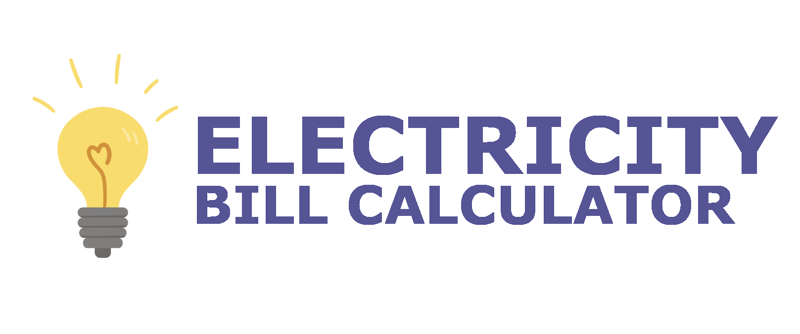

# Electricity Bill Calculator

Nifty little program to draw up an electricity bill for a given tariff structure according to user-specificed date-time regions. Made with Python and Tkinter (plus some other libraries too).

## Instructions

Firstly, to install all dependencies that are needed for the project, cd into the project directory and run:

`pip install -r requirements.txt`

Then, to start the program, simply run:

`python3 main.py`

## Using the program

This application accepts two files: a load profile .csv file with a record of meter readings in Wh (watt-hours), and a .json file which specifies the format of the block tariffs according to which the electricity bill will be calculated. The application will launch with two default files selected, though the user can select any files of their own so long as they adhere to the correct formats.

From there, you will be displayed the full calculation for the electricity bill, as well as a graph display of the electricity used over time. You can also adjust the region of time to either the entire region, a specific calendar month or a custom region, and the graph and electricity bill will update according to your choice.

## Assumptions

The calculations within this application were applied with the following assumptions in mind:

- The single-phase house is a domestic, residential unit, i.e. not a non-domestic, business or industrial unit.
- The unit is a single house, not part of a complex or gated community.
- The resident of the house is not an indigent customer.
- VAT is to be ignored.

